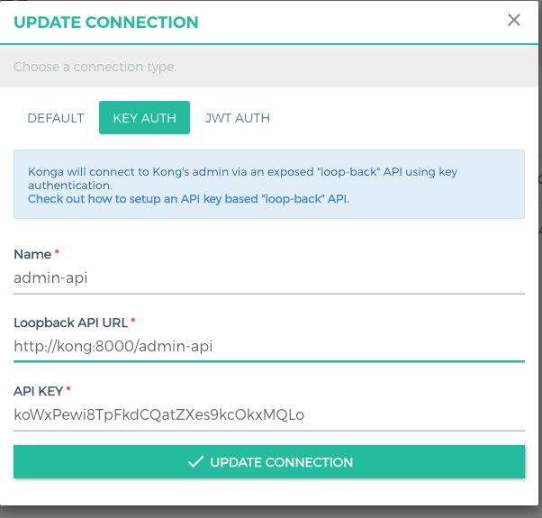

# Arquitetura de Software Distribuídos

## Trabalho de Conclusão de Curso PUC Minas - POC

Antes de tudo é preciso criar um arquivo .dev na pasta env com as seguintes variáveis de ambiente:
`ENVIRONMENT=dev
TESTING=0
DATABASE_URL=mysql://user:password@db:3306/sistemagestaoentregas

SQL_DATABASE=sistemagestaoentregas
SQL_USER=user
SQL_PASSWORD=password
SQL_HOST=db
SQL_PORT=3320`

Para levantar o projeto basta ter o docker instalado e rodar o comando:
`docker compose up --build --scale web=3`

Todos os serviços serão levantados, mas ainda é necessário importar os dados para a base de dados, o arquivo `sistemagestaoentregas.sql` contem esses dados.

Também é necessário configurar o API Gateway seguindo os passos a baixo:

- Adicionar Kong Admin API como um serviço:
  `curl --location --request POST 'http://localhost:8001/services/' \ --header 'Content-Type: application/json' \ --data-raw '{ "name": "admin-api", "host": "localhost", "port": 8001 }'`
- Criar uma rota para o Admin API:
  `curl --location --request POST 'http://localhost:8001/services/admin-api/routes' \ --header 'Content-Type: application/json' \ --data-raw '{ "paths": ["/admin-api"] }'`
- Habilitar o Key Auth Plugin:
  `curl -X POST http://localhost:8001/services/admin-api/plugins \ --data "name=key-auth" `
- Adicionar Konga como um consumidor:
  `curl --location --request POST 'http://localhost:8001/consumers/' \ --form 'username=konga' \ --form 'custom_id=cebd360d-3de6-4f8f-81b2-31575fe9846a'`
- Criar um API Key para o Konga:
  `curl --location --request POST 'http://localhost:8001/consumers/{id retornado na requisicao anterior}/key-auth'`

Com a API Key gerada é possível conectar o Konga com o Kong acessando `localhost:1337`

Agora é preciso adicionar o serviço e configurar o load balancer.

Vá até à seção "SERVICES" e adicione um novo serviço com:
`Name: api-sge`
`Host: host.docker.internal`
`Path: /`

Vá até à seção "ROUTES" e adicione uma nova rota com:
`Name: entregas`
`Paths: /api/v1/`
`Methods: GET`
`Protocols: http`

Por último é necessário criar um upstream com seus targets, vá até à seção "UPSTREAMS" e crie um upstream com:
`Name: host.docker.internal`

Na subseção "Targets" adicione 3 targets:
`host.docker.internal:8004`
`host.docker.internal:8005`
`host.docker.internal:8006`

E com isso a aplicação estará rodando com o load balancer do API Gateway configurado.

Agora basta enviar uma requisição GET para `http://localhost:8000/api/v1/entregas` com o header `user_id`, o valor de `user_id` deve ser 1, 2 ou 3.

`curl -i localhost:8000/api/v1/entregas -H "user_id: 3"`
